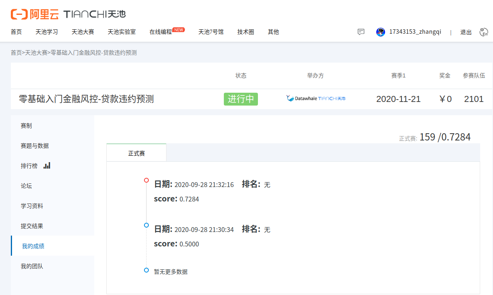

# Week1 Report

## 一、前言
我在大三下并没有选梁老师开的数据挖掘这门课，所以在此之前对于这一块其实的内容了解的不是很多，常用的思路和方法之类的也是“一窍不通”，所以还是得先补补课。

## 二、本周完成的内容
1. 浏览/学习了梁老师在数据挖掘课上使用的课件。
2. 了解并使用了一些数据挖掘中常用的python Module（numpy、pandas、matplotlib等）
3. 提交了一次天池学习赛（第一次手滑误把sample_submit.csv提交上去了）：

## 三、下周计划
继续学习有关数据挖掘的相关内容，并且将这个提交优化一下，看一下能不能上榜...