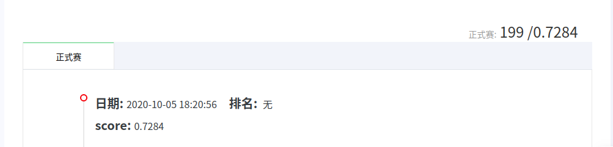

# Week2 Report

## 一、理论学习
参照Datawhale提供的[baseline教程](https://github.com/datawhalechina/team-learning-data-mining/tree/master/FinancialRiskControl)进行学习，学习其思路：数据预处理 - 模型建立 - 进行训练，最后将不同的模型得到结果进行加权得到最终的结果。并且学习其在代码中使用的函数，搜索函数的作用及其相关的参数。

## 二、天池成绩

## 三、遇到的问题
进行训练时，没运行一次程序都需要花费很长的时间（5 hours），但是貌似在网上有没有查到相关的教程能够使用GPU进行加速，所以预感后续进行调参时会比较难出结果，比较麻烦。