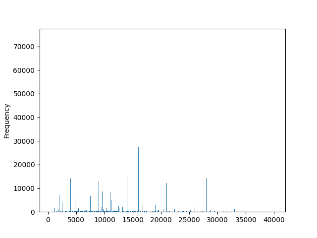
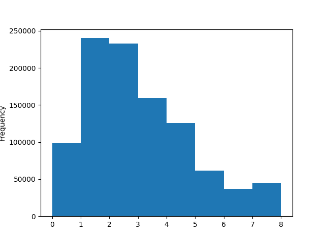
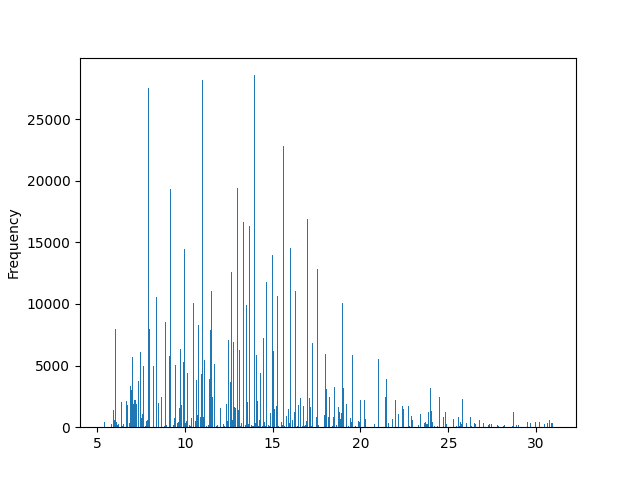
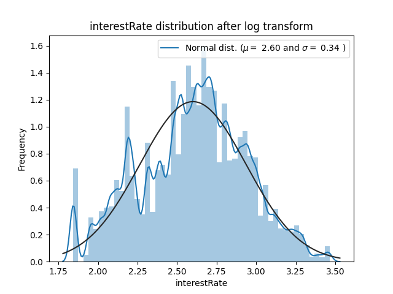
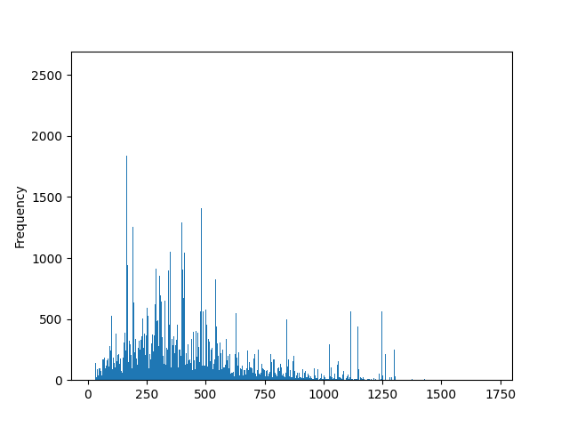
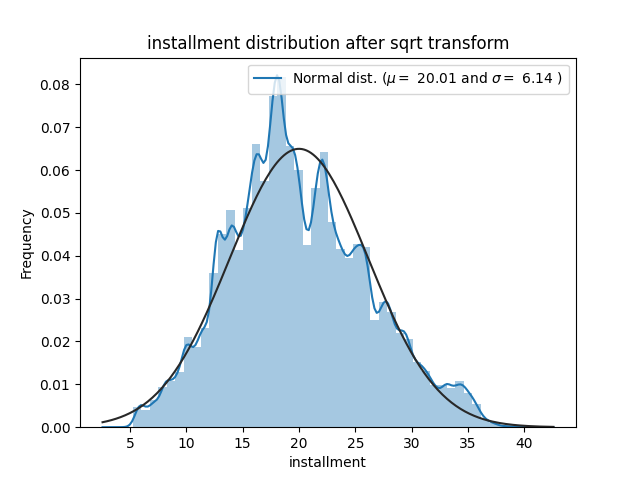
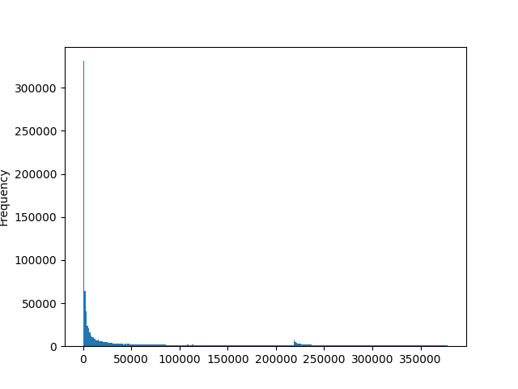
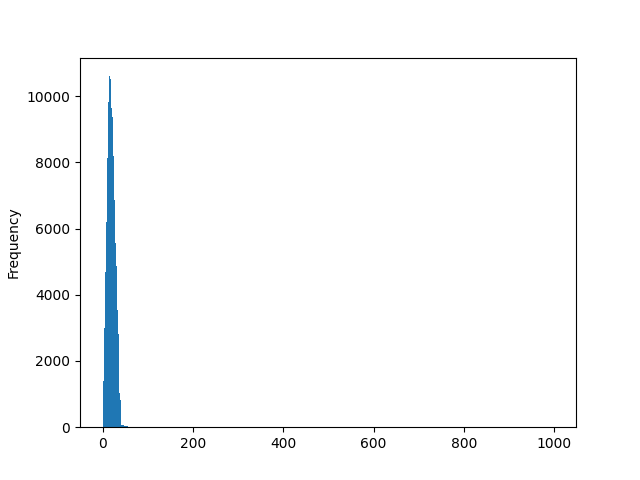
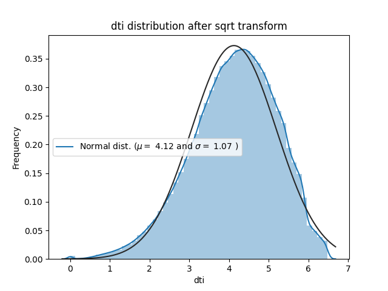

# Week2 Report

## 一、理论学习
学习并实践TA上课时所给的课件，以及在对天池学习赛的数据进行处理过程中使用搜索引擎掌握了一些方法。然后也看到了Datawhale给出了一些[官方讲解视频](https://github.com/datawhalechina/team-learning-data-mining/tree/master/FinancialRiskControl)，打算接下来去学习一下。

## 二、数据预处理
### 【数据填充】
对于学习赛中的所有NAN值数据均采用**加权平均数**进行填充。

### 【数据变换】
1. loanAmnt

处理前数据虽然有“8组峰”,但是数据过于分散：

因此采用**分箱法**，在保留绝大部分信息的情况下将其分为8类:

2. interestRate

处理前数据呈偏态分布：

所以使用**log变换**使其更接近于高斯分布：

3. installment

处理前数据呈偏态分布：

所以使用**开方变换**使其更接近于高斯分布：

4. employmentTitle

呈现出一种极为“偏激”的分布，不知道应该如何处理这类数据，还是不作处理直接去训练吧：

5. dti

数据范围从-1到999，粒度为0.01，但绝大部分数据都在0-40之间近似呈高斯分布，其余范围只有零散的几个数据：

因此可以将大于40的数据随机分布到40-41，将NAN值“归结到峰值”20，再使用sqrt变化使得整个数据呈正态分布：

### 【数据取舍】
- *grade* 属性是 *subGrade*的前缀，故只需保留后者即可。
- 结合[FICO的作用](https://baike.baidu.com/item/FICO/22143941)，以及通过分析得知*ficoRangeLow*与*ficoRangeHigh*两者的差中99.985%是4，0.015%是5，所以只需要保留其中一个即可。

## 三、天池成绩

