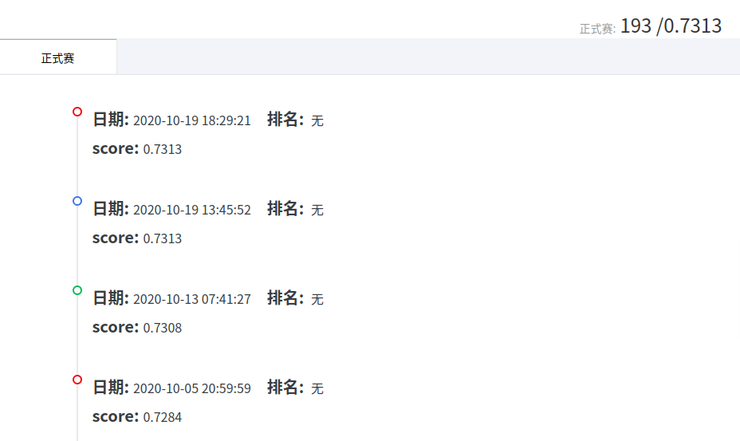

# Week4 Report

## 一、本周完成的内容
1. 使用倍速看完了DataWhale提供的学习视频[赛题理解baseline讲解](https://tianchi.aliyun.com/course/video?liveId=41203)以及[数据探索性分析和特征工程](https://tianchi.aliyun.com/course/live?liveId=41204)
2. 了解并学习了[EDA](https://www.cnblogs.com/HuZihu/p/11146493.html)
3. 在原来结果由LightGBM算法和XGBoost算法加权得到的基础上再引入CatBoost算法，通过三者加权训练得到的数据加权得到最终结果，成绩较上一次有微弱进步。

## 二、天池成绩

