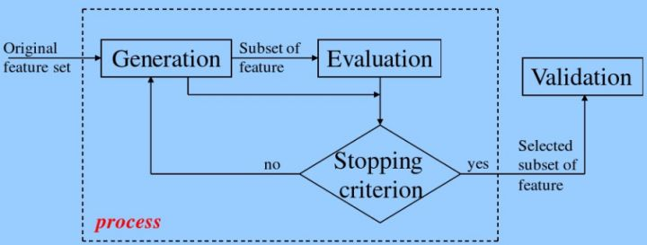
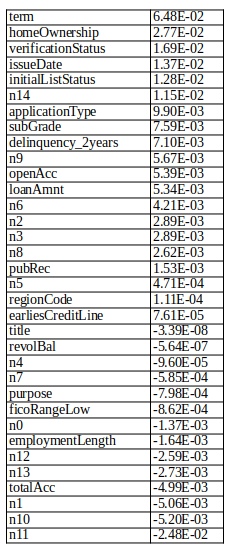
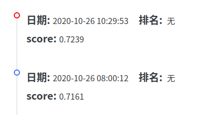
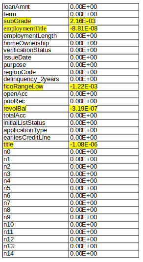
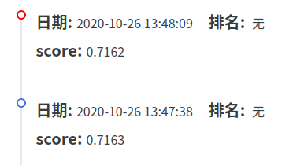
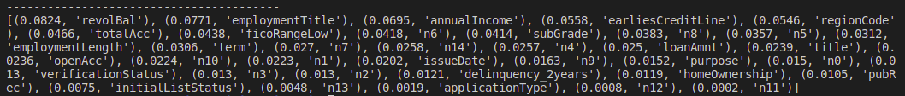
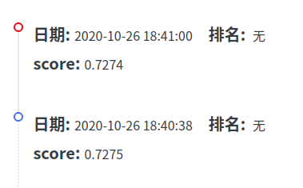

# Week5 Report

> 注：因Github提供的Markdown预览中不支持Latex语法，因此推荐阅读[PDF版本](./Week5.pdf)。

## 一、理论学习
借助TA使用的课件以及相关博客学习了关于“特征选择”的理论以及方法。

### （一）目的
特征选择希望通过剔除不相关或冗余的特征，从而达到减少特征个数，找到最优特征子集，进而提高模型精确度，减少运行时间。

### （二）一般流程
特征选择主要包括产生过程，评估过程，停止条件和验证过程：

### （三）常见方法
**1. 过滤法（Filter）：按照发散性或者相关性对各个特征进行评分，设定阈值或者待选择阈值的个数，选择特征。**

过滤特征选择法的想法是针对每个特征 $x_i$，$i$ 从 $1$ 到 $n$ ，计算 $x$ 相对于类别标签 $y$ 的信息量 $S(i)$ ，得到 $n$ 个结果，然后将 $n$ 个 $S(i)$ 按照从大到小排序，输出前 $k$ 个特征。显然，这样复杂度大大降低。那么关键的问题就是使用什么样的方法来度量  $S(i)$ ，我们的目标是选取与 $y$ 关联最密切的一些 特征$x_i$。

**(1) Pearson相关系数**

皮尔森相关系数是一种最简单的，能帮助理解特征和响应变量之间关系的方法，该方法衡量的是变量之间的线性相关性，结果的取值区间为 $[-1, +1]$ ， $-1$表示完全的负相关(这个变量下降，那个就会上升)， $+1$ 表示完全的正相关， $0$ 表示没有线性相关。Pearson Correlation速度快、易于计算，**经常在拿到数据(经过清洗和特征提取之后的)之后第一时间就执行**。
Pearson相关系数的一个明显缺陷是，作为特征排序机制，他**只对线性关系敏感**。如果关系是非线性的，即便两个变量具有一一对应的关系，Pearson相关性也可能会接近 $0$。

**(2) 卡方验证**

经典的卡方检验是检验定性自变量对定性因变量的相关性。假设自变量有N种取值，因变量有M种取值，考虑自变量等于i且因变量等于j的样本频数的观察值与期望的差距，构建统计量：$x^2 = \sum\frac{(A-E)^2}{E}$
简而言之就是**自变量对因变量的相关性**。

**(3)互信息和最大信息系数(MIC)**
经典的互信息也是评价定性自变量对定性因变量的相关性的，当 $x_i$ 是0/1离散值的时候，互信息公式如下：$MI(x_i,y) = \displaystyle\sum_{x_i\in{0,1}}\displaystyle\sum_{y_i\in{0,1}}p(x_i,y)\log{\frac{p(x_i,y)}{p(x_i)p(y)}}$
想把互信息直接用于特征选择其实不是太方便：1、它不属于度量方式，也没有办法归一化，在不同数据及上的结果无法做比较；2、对于连续变量的计算不是很方便（ $X$ 和 $Y$ 都是集合, $x_i$, $y$ 都是离散的取值），通常变量需要先离散化，而互信息的结果对离散化的方式很敏感。
最大信息系数克服了这两个问题。它首先寻找一种最优的离散化方式，然后把互信息取值转换成一种度量方式，取值区间在 。

**(4)距离相关系数**

距离相关系数是为了克服Pearson相关系数的弱点而生的。如果距离相关系数是 0 ,那么我们就可以说这两个
变量是独立的。但其缺点是速度慢、计算复杂。

**(5)方差选择法**

过滤特征选择法还有一种方法不需要度量特征 $x_i$ 和类别标签 $y$ 的信息量。这种方法先要计算各个特征的方差，然后根据阈值，选择方差大于阈值的特征。

例如，假设我们有一个具有布尔特征的数据集，并且我们要删除超过80％的样本中的一个或零（开或关）的所有特征。布尔特征是伯努利随机变量，这些变量的方差由下式给出:$Var[X] = p(1-p)$

**2. 包装法（wrapper）：根据目标函数（通常是预测效果评分），每次选择若干特征，或者排除若干特征。**

Wrapper这里指不断地使用不同的特征组合来测试学习算法进行特征选择。先选定特定算法， 一般会选用普遍效果较好的算法， 例如Random Forest， SVM， kNN等等。

**(1)前向搜索**

每次增量地从剩余未选中的特征选出一个加入特征集中，待达到阈值或者 $n$ 时，从所有的 $F$ 中选出错误率最小的。过程如下：
- 初始化特征集 $F$ 为空。
- 扫描 $i$ 从 $1$ 到 $n$
    - 如果第 $i$ 个特征不在 $F$ 中，那么特征 [$i$ 和 $F$ 放在一起作为 $F_i$ (即 $F_i = F\cup\{i\}$ )。
在只使用 $F_i$ 中特征的情况下，利用交叉验证来得到$F_i$的错误率。
- 从上步中得到的 $n$ 个 $F_i$ 中选出错误率最小的 $F_i$ ,更新 $F$ 为 $F_i$ 。
- 如果 $F$ 中的特征数达到了 $i$ 或者预定的阈值（如果有的话），
那么输出整个搜索过程中最好的 ；若没达到，则转到 2，继续扫描。

**(2)后向搜索**

既然有增量加，那么也会有增量减，后者称为后向搜索。先将 $F$设置为 $\{1,2,3,...,n\}$ ，然后每次删除一个特征，并评价，直到达到阈值或者为空，然后选择最佳的 $F$ 。

**(3)递归特征消除法**
递归消除特征法使用一个基模型来进行多轮训练，每轮训练后，消除若干权值系数的特征，再基于新的特征集进行下一轮训练。

**3. 嵌入法（Embedded）：先使用某些机器学习的算法和模型进行训练，得到各个特征的权值系数，根据系数从大到小排序选择特征。类似于Filter方法，但是是通过训练来确定特征的优劣。**

**(1)基于惩罚项的特征选择法**

通过L1正则项来选择特征：L1正则方法具有稀疏解的特性，因此天然具备特征选择的特性，但是要注意，L1没有选到的特征不代表不重要，原因是两个具有高相关性的特征可能只保留了一个，如果要确定哪个特征重要应再通过L2正则方法交叉检验。

**(2)基于学习模型的特征排序**
这种方法的思路是直接使用你要用的机器学习算法，针对每个单独的特征和响应变量建立预测模型。假如某个特征和响应变量之间的关系是非线性的，可以用基于树的方法（决策树、随机森林）、或者扩展的线性模型等。基于树的方法比较易于使用，因为他们对非线性关系的建模比较好，并且不需要太多的调试。但要注意过拟合问题，因此树的深度最好不要太大，再就是运用交叉验证。通过这种训练对特征进行打分获得相关性后再训练最终模型。

## 二、具体实践
### （一）Pearson相关系数
对数据集进行预处理后，排除一些显然无用的属性（'id'、'isDefault'、'grade'、'postCode'、'ficoRangeHigh'）以及类型为浮点型的属性（'interestRate','installment','dti'、'pubRecBankruptcies','revolUtil'）然后使用`DataFrame.corr(method='pearson')['isDefault'] `得到其他属性与'isDefault'属性的Pearson相关系数，并且将其进行降序排序得到下表：

**将上表中绝对值大于$5*10^-3$的属性作为选择的特征，以及在上述步骤中因为是浮点数而被舍弃但现实中有明显相关的属性**丢进去进行训练，得到以下结果：

### （二）L1正则化 /Lasso
步骤同上，使用`sklearn.linear_model.Lasso.fit(x,y)`得到下表：

对于上图中黄色标注的值非零的属性，以及其他现实中明显相关的属性一起进行训练，得到以下结果：

### （三）随机森林之mean decrease impurity
步骤同上，使用`sklearn.ensemble.RandomForestRegressor.fit(x,y)`得到的结果如下图：

对于上图中**值大于0.02的属性**以及其他现实中明显相关的属性一起进行训练，得到以下结果：

## 三、总结反思
大概是因为相关参数没有设置好，亦或者太过“偏信于”一个函数所得到的数值而原始数据进行选择，所以得到的结果并不理想，反而比全部属性扔进去训练得到的结果都要差一截...应该需要采用多种方法进行加权处理来进行最终的特征选择。