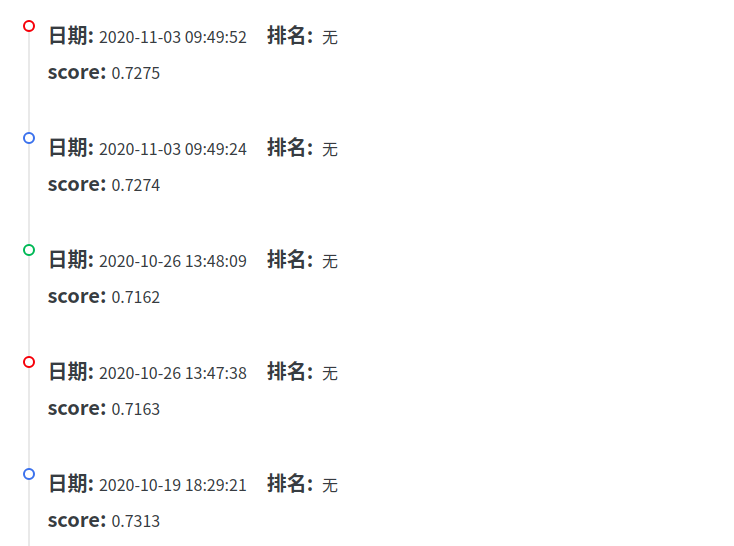

# Week6 Report

## 一、本周完成的任务
按照[上周的计划](./Week5.md)，本周在上周对数据集分别使用Pearson相关系数、L1正则化、随机森林的基础上进行加权处理，大致就是将不同方法得到的相关系数进行排序，然后从将排名与分数挂钩，综合三种方法，再次按照分数排序，取其中分数较高者作为训练数据（例如：特征X在Pearson中排第1，在L1正则化中排第2，在随机森林中排第3，则其最终分数为100+90+80），因为此过程过于枯燥所以此处不放截图。

但是试过好几次之后，这种方法得到的成绩也没有之前单纯对数据做预处理后得到的成绩高，这就比较令人困惑了。

对比了一下各位同学的周报，发现**吴劢同学**目前的成绩是最高的，然后从[他第五周的周报](https://github.com/AmarKingso/DataMiningTraining/blob/master/week_report_5.md)中看到这么一句话”*但是由于对模型的不熟悉，导致自己做了很多无用功，例如想着如何进行特征选择以及归一化，后来深入了解了才发现对于lightGBM来说这些处理都不是必要的。后来对异常值的处理让分数也有提升，但提升真的很小，反倒是几次对模型的调参，让成绩有了较大的提升。*“，或许目前我要想提高成绩，应该对模型进行深入的了解，在训练模型上进行调整，而纠结、停步于数据预处理和特征选择阶段。

## 二、本周成绩
