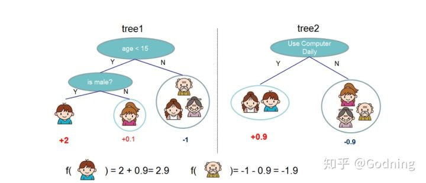
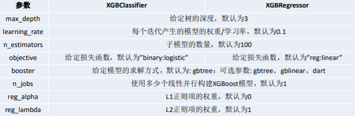
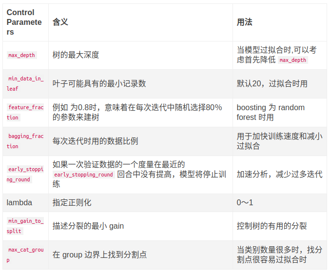
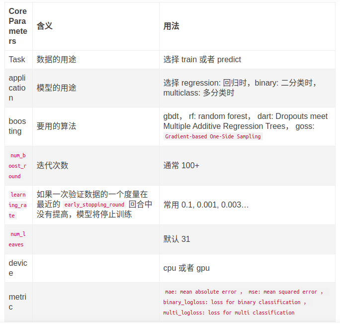
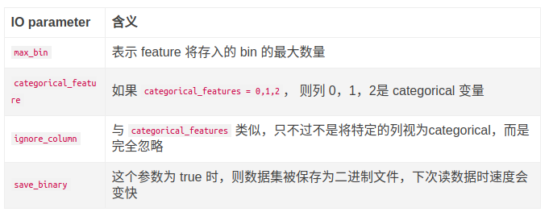
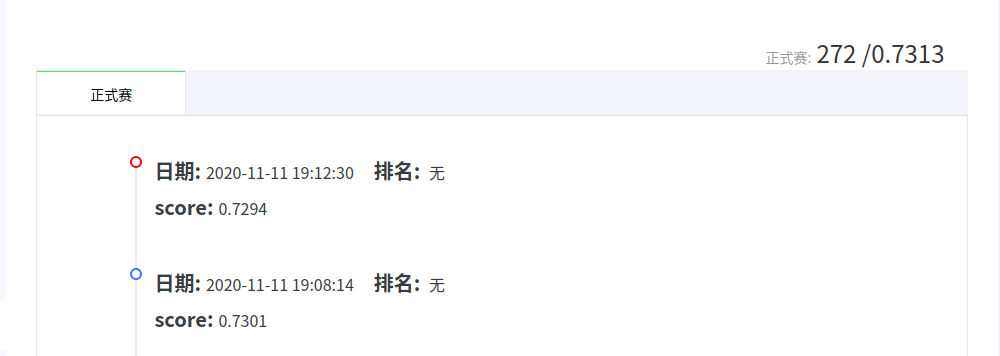

# Week7 Report

## 一、本周完成的任务
按照[上周的计划](./Week6.md),本周对LightGBM和XGBoost进行调参。

## 二、理论学习
首先得大概明白LightGBM和XGBoost大概是怎么一个原理，然后才能大致有个方向来进行调参。不然的话本来完整运行一次就需要好几个钟头，啥也不懂就在瞎搞会很糟心。

### （一）XGBoost
XGBoost是boosting算法的其中一种。Boosting算法的思想是将许多弱分类器集成在一起形成一个强分类器。XGBoost是一种提升树模型，它是将许多树模型集成在一起，形成一个很强的分类器，所用到的树模型则是CART回归树模型。

XGBoost算法思想就是不断地添加树，不断地进行特征分裂来完成一棵树的构建。每次添加一个树，实际上是学习一个新函数，去拟合上次预测的残差。我们训练完成时会得到​ k 棵树 。当我们要预测一个样本的分数时，根据这个样本的特征，在每棵树中会落到对应的一个叶子节点，每个叶子节点就对应一个分数，最后只需要将每棵树对应的分数加起来就是该样本的预测值。如下图所示，训练出了2棵决策树，小孩的预测分数就是两棵树中小孩所落到的结点的分数相加。爷爷的预测分数同理：

XGBoost可以成为机器学习的大杀器，广泛用于数据科学竞赛和工业界，是因为它有许多**优点**：
>1. 使用许多策略去防止过拟合，如：正则化项、Shrinkage and Column Subsampling等。
>2. 目标函数优化利用了损失函数关于待求函数的二阶导数。
>3. 支持并行化，这是XGBoost的闪光点，虽然树与树之间是串行关系，但是同层级节点可并行。具体的对于某个节点，节点内选择最佳分裂点，候选分裂点计算增益用多线程并行。训练速度快。
>4. 添加了对稀疏数据的处理。
>5. 交叉验证，early stop，当预测结果已经很好的时候可以提前停止建树，加快训练速度。
>6. 支持设置样本权重，该权重体现在一阶导数​ g 和二阶导数 h ​，通过调整权重可以去更加关注一些样本。

但相应的，XGBoost也因算法采用贪心策略而有较为耗时的**缺点**。

- XGBoost的参数一共分为三类：
> 全部参数[详见此处](https://xgboost.apachecn.org/#/docs/15)
>1. 通用参数：宏观函数控制。
>2. Booster参数：控制每一步的booster(tree/regression)。booster参数一般可以调控模型的效果和计算代价。我们所说的调参，很这是大程度上都是在调整booster参数。
>3. 学习目标参数：控制训练目标的表现。我们对于问题的划分主要体现在学习目标参数上。比如我们要做分类还是回归，做二分类还是多分类，这都是目标参数所提供的。

- 其中**XGBoost重要的参数**如下图所示：

- 调参：
>这个过程我参照了此博客中的步骤进行：[XGboost数据比赛实战之调参篇(完整流程)](https://cloud.tencent.com/developer/article/1080593)

### （二）LightBGM
LightGBM是Microsoft在2017年开源的一个梯度 boosting 框架,使用基于学习算法的决策树，它能够解决热门算法XGBoost训练耗时很长，内存占用比较大的缺点：LightGBM能够在不降低准确率的前提下，速度提升了10倍左右，占用内存下降了3倍左右。

LightGBM 利用基于 histogram 的算法（而非像XGBoost默认对于决策树的学习使用基于 pre-sorted 的算法），通过将连续特征（属性）值分段为 discrete bins 来加快训练的速度并减少内存的使用。 

- 重要参数的含义和如何应用：
> 全部参数[详见此处](https://lightgbm.apachecn.org/#/docs/6)

- 调参：
>这个过程我参照了此博客中的步骤进行：[LightGBM调参笔记](https://blog.csdn.net/u012735708/article/details/83749703)

## 三、成绩
1. 本周：

2. 最佳：0.7313
