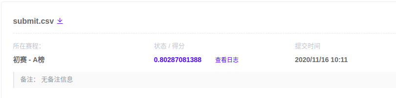

# Week8 Report

## 一、本周完成的任务
1. 初步理解了一下大作业这个比赛的内容，发现这个比赛跟之前的学习赛差别有点大：数据集多了好几个，而且给的数据也是五花八门（但缺失值太多）...感觉一股脑丢进去训练的话会过拟合。
2. 挑选了`base_info.csv` 和 `entprise_info`两个文件作为输入，然后再原来学习赛的代码上做出一些修改之后进行训练跑分。

## 二、下周工作的计划
这样弄出来的成绩并不太理想，所以应该还是得先对数据进行预处理一下，再来个特征选择之类的，以及把多个模型融合一下，把分数搞高一点。

## 三、本周成绩

